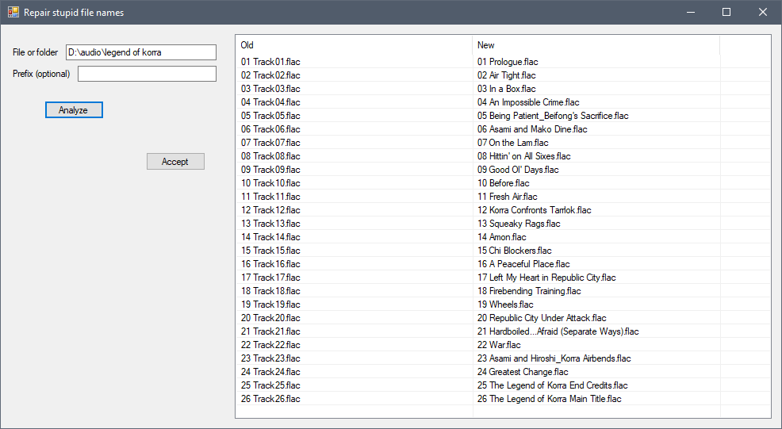

# Repair stupid file names

Renames media files according to ID3 tags.

Useful if the file names got mangled for some reason (encoding issues) or if they weren't generated at all.

Uses `taglib#` and therefore probably works with any file format `taglib#` supports, which is at least flac, ogg and mp3. Probably many others.

Renames file names according to `$"{prefix}{trackNumber} {title}{extension}"`. Lets you review pending operations before doing any actual renames.
